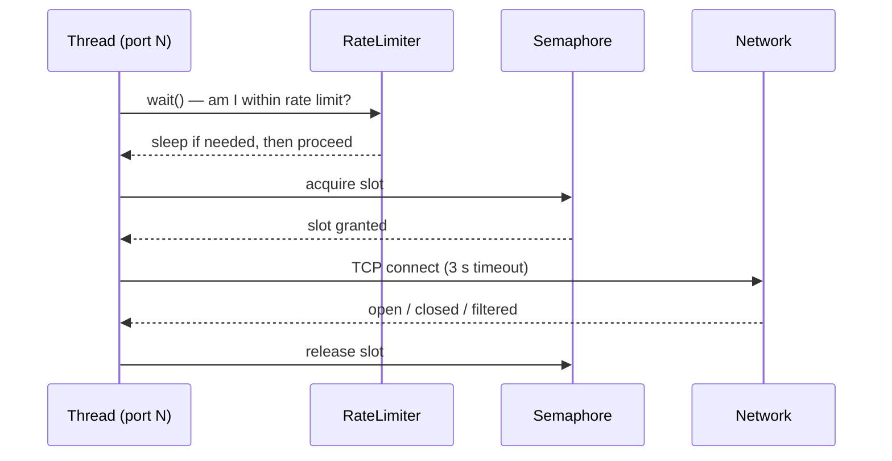

The scanner has two independent mechanisms that together control scan speed:

1. **Rate limiter** — caps how many probes are _started_ per second
2. **Semaphore** — caps how many TCP connections are _open_ at the same time

Both are configured via CLI flags and cooperate inside the `limited_scan()` function.

## The RateLimiter class

The `RateLimiter` class uses a **sliding-window algorithm** backed by a `collections.deque` of UNIX timestamps.

```python
class RateLimiter:
    def __init__(self, max_per_second):
        self.max_per_second = max_per_second
        self.lock = threading.Lock()
        self.timestamps = collections.deque()
```

### How `wait()` works

Every thread calls `rate_limiter.wait()` before starting a scan. The method:

1. Acquires the internal lock (one thread at a time)
2. Records the current timestamp in the deque
3. If the deque has reached `max_per_second` entries, pops the oldest timestamp
4. Calculates `wait_time = 1.0 - (now - oldest)`
5. Sleeps for `wait_time` seconds if it is positive — ensuring that
   `max_per_second` probes are spread over at least one full second

```python
def wait(self):
    with self.lock:
        now = time.time()
        self.timestamps.append(now)
        if len(self.timestamps) >= self.max_per_second:
            oldest = self.timestamps.popleft()
            wait_time = 1.0 - (now - oldest)
            if wait_time > 0:
                time.sleep(wait_time)
```

<Note>
  Because `wait()` holds the lock while sleeping, all other threads queue
  behind it. This guarantees the rate limit is respected even under heavy
  thread concurrency.
</Note>

## The semaphore

A `threading.Semaphore(thread_limit)` is created in `main()` and passed to every
thread. Each thread must acquire a slot before calling `port_scan()`, and
releases it automatically when the `with semaphore:` block exits.

```python
def limited_scan(port, target_host, semaphore, rate_limiter):
    rate_limiter.wait()        # enforce probes-per-second
    with semaphore:            # enforce max concurrent connections
        port_scan(target_host, port)
```

This prevents the OS from running out of file descriptors or the target from
receiving hundreds of simultaneous SYN packets.

## The per-port sleep

In addition to the two mechanisms above, `port_scan()` itself calls
`time.sleep(0.05)` at the end of every scan — a fixed 50 ms pause per thread.
This adds a small buffer between consecutive scans on the same thread and
reduces the chance of socket exhaustion.

## How the two mechanisms interact



- The **rate limiter** controls _throughput_ (probes/second).
- The **semaphore** controls _concurrency_ (simultaneous open sockets).
- A thread may pass the rate limiter but still wait at the semaphore if all
  slots are occupied.

## Choosing the right values

<AccordionGroup>
  <Accordion title="Fast local network scan">
    On a LAN where you control the target, round-trip times are in the
    sub-millisecond range and there is no risk of triggering IDS alerts.

    ```bash
    python Port_scanner.py 192.168.1.1 -t 200 -r 500
    ```

    High thread count and rate limit give maximum throughput. Even so, the
    3-second TCP timeout means filtered ports still take time — keep the port
    range focused when possible.
  </Accordion>

  <Accordion title="Remote host scan">
    Against an internet-facing host, network latency is higher and the target
    owner may have rate-based firewall rules.

    ```bash
    python Port_scanner.py example.com -t 50 -r 20
    ```

    Moderate values balance speed against the risk of triggering connection
    limits or receiving ICMP rate-limiting responses.
  </Accordion>

  <Accordion title="Stealth / low-noise scan">
    When minimising detection risk or being respectful of a shared network,
    keep both values low.

    ```bash
    python Port_scanner.py 203.0.113.10 -t 5 -r 2
    ```

    At 2 probes per second, a 1024-port scan takes roughly 8 minutes. Use a
    narrow port range (`-s`/`-e`) to keep scan time reasonable.
  </Accordion>
</AccordionGroup>

## Trade-offs

| Concern | Recommendation |
|---|---|
| Scan completes too slowly | Increase `-r` and `-t` |
| Target host becomes unreachable during scan | Decrease `-r` and `-t` |
| Many ports reported as filtered | Lower `-r`; slow probes are less likely to be dropped |
| Local machine runs out of file descriptors | Decrease `-t` (fewer concurrent sockets) |
| IDS / firewall blocking scan | Decrease `-r` to reduce probes-per-second |

<Warning>
  Setting `-r` or `-t` very high against systems you do not own may trigger
  automated abuse-detection systems or violate the target's terms of service.
  Always obtain explicit permission before scanning.
</Warning>
